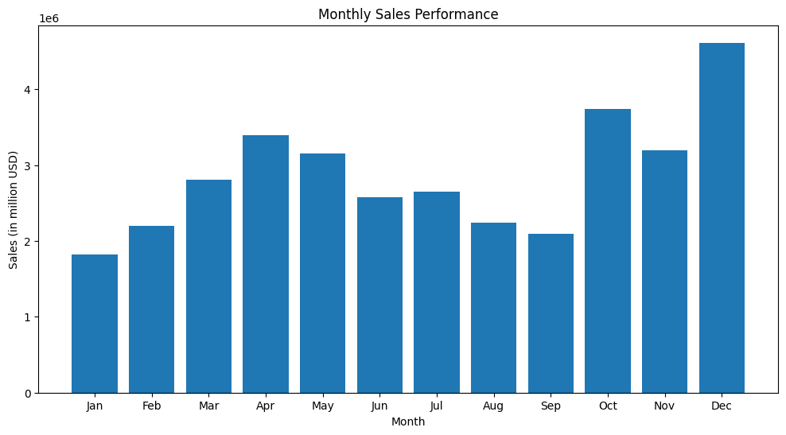
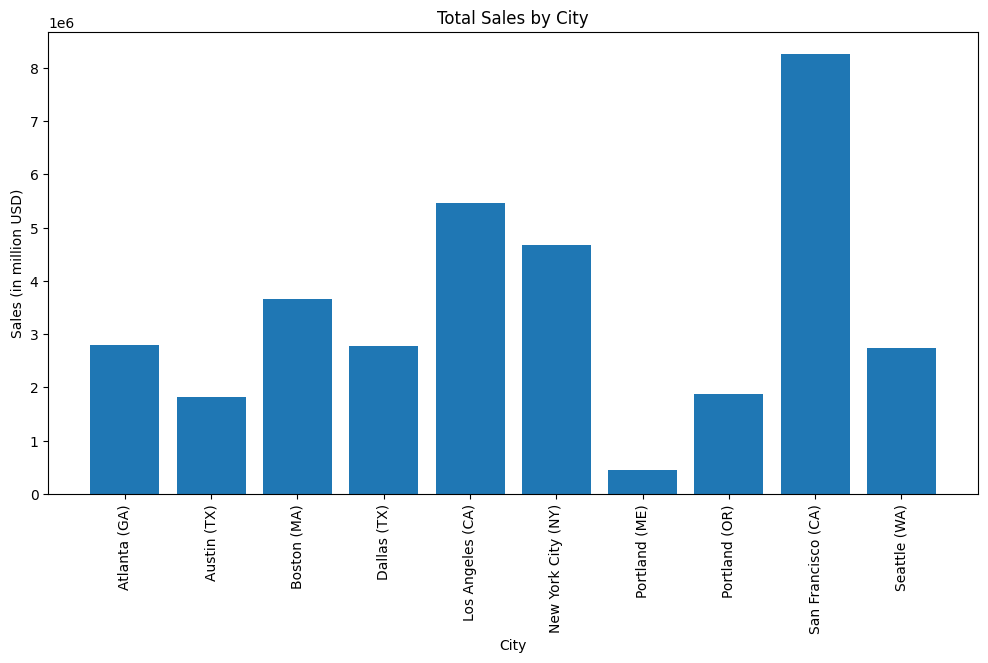
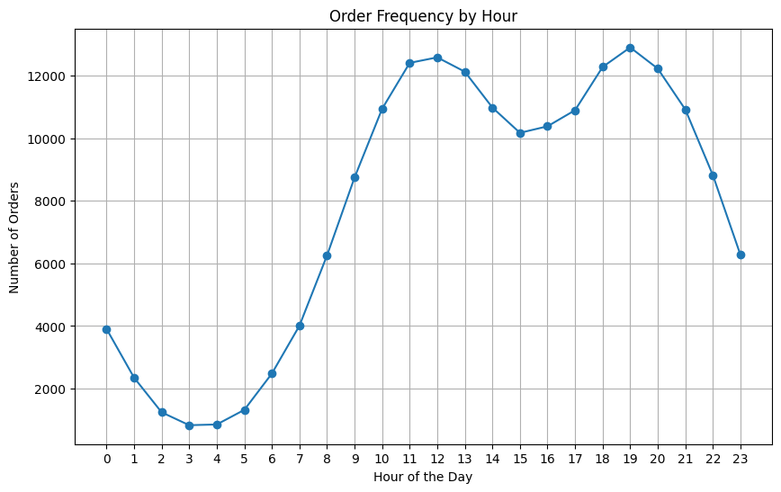
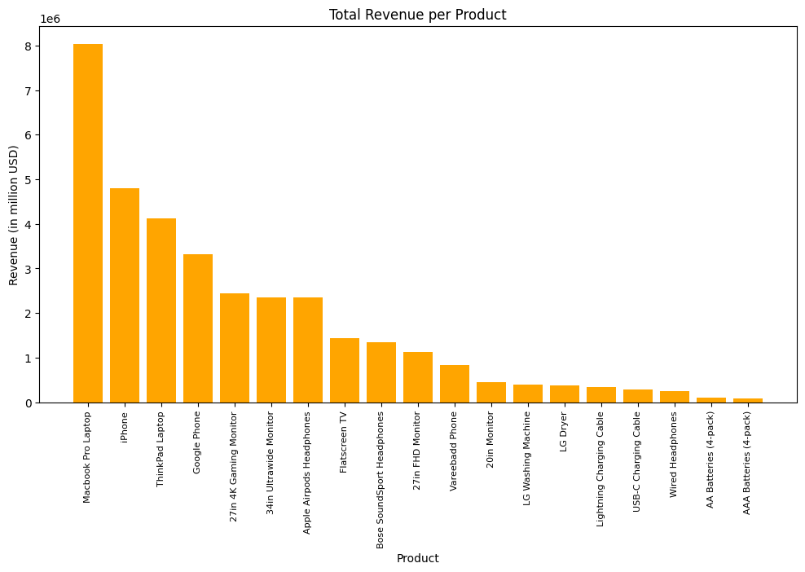

# Sales Performance Analysis – Electronics Retail Chain

## Project Overview
This project analyzes one year of sales data from an electronics retail chain in the United States.  
The goal is to clean, transform, and visualize the data to uncover trends and provide actionable insights that could support business decisions such as inventory planning, marketing timing, and regional targeting.

---

## Dataset
**Source:** Monthly CSV files containing sales transactions for 12 months.
**Fields:**  
- **Order ID**  
- **Product**
- **Quantity Ordered** 
- **Price Each**  
- **Order Date**  
- **Purchase Address**

---

## Main Analyses
1. **Monthly Sales Trends** - Identify high- and low-performing months to guide seasonal marketing.
2. **City-Level Performance** - Find the best-performing locations for targeted campaigns.
3. **Optimal Sales Hours** - Discover peak hours for advertising and promotions.
4. **Product Profitability** - Understand which products generate the most revenue and how pricing affects sales.

---

## Tools & Technologies
- **Python** – Pandas, NumPy, Matplotlib, AdjustText
- **Jupyter Notebook** - analysis and documentation
- **Git / GitHub** - version control and portfolio presentation

---

## Example Plots
**Monthly Revenue**



**Revenue by City**



**Orders by Hour**



**Product Price vs Revenue**



---

## Analysis Workflow

1. **Data Loading**  
   - Read all monthly CSV files  
   - Merge them into a single DataFrame

2. **Data Cleaning**  
   - Remove missing values and invalid rows  
   - Correct data types (e.g., date parsing)  
   - Remove placeholder or header rows inside the data  

3. **Feature Engineering**  
   - Extract **Month** and **Hour** from `Order Date`  
   - Calculate **Sales** as `Quantity Ordered × Price Each`  
   - Extract **City** and **State** from `Purchase Address`

4. **Exploratory Data Analysis (EDA)**  
   - **Sales by Month** – Identify seasonal trends  
   - **Sales by City** – Compare regional performance  
   - **Sales by Hour** – Find peak purchasing times  
   - **Most Profitable Products** – Analyze product-level revenue and price relationships  

5. **Visualization**  
   - Line plots for sales trends  
   - Bar charts for regional sales  
   - Scatter plots with annotations for product profitability

---

## Key Insights
- **December** had the highest revenue, likely due to the holiday season.  
- **San Francisco** generated the highest total revenue among all cities.  
- Peak purchase hours occurred around **11 AM** and **7 PM**.  
- Higher-priced products generally correlate with higher revenue, though there are outliers.

---

## How to Run This Project

```bash
# Clone the repository
git clone https://github.com/IljaGebert/sales-performance-analysis.git

# Navigate to the project folder
cd sales-performance-analysis

# Install dependencies
pip install -r requirements.txt

# Run the Jupyter Notebook
jupyter notebook
